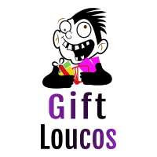

    
    <h2>Loja de Gift Cards<h2>

## Objetivo
O projeto entregará a loja: GiftLoucos, uma loja de venda de gift cards para Jogos, serviços de Streaming e Lojas.

O objetivo é implementar as principais funcionalidades da loja (Mostrar os produtos, adionar ao carrinho, favoritar e cadastrar novos produtos). Funcionalidades como usuários e controle de estoque será algo futuro a ser adicionado.

### Páginas

* Tela Home
* Tela Carrinho
* Tela Favoritos
* Tela Cadastro
* Tela Sobre

### Funcionalidades
* Buscar gift cards.

    - No Home será possível visualizar os gift cards que a loja contém. Sendo possível buscá-los por: Todos, Categorias ou por nome do Gift Card.

* Apresentar produtos em promoção

    - Visualmente teremos um Slider com os gifts que estão em promoção.

* Representar graficamente as estatísticas de vendas

    - Consiste de um gráfico de barras representando a quantidade de vendas das categoria presentes (Jogos, Lojas, Streaming).

* Favoritar produtos

    - Será possível favoritar o gift card de sua escolha.

* Carrinho

    - O carrinho terá todos os produtos previamentes adicionados. O Total da quantidade daqueles produtos e opções para finalizar compra e remover produto do carrinho.